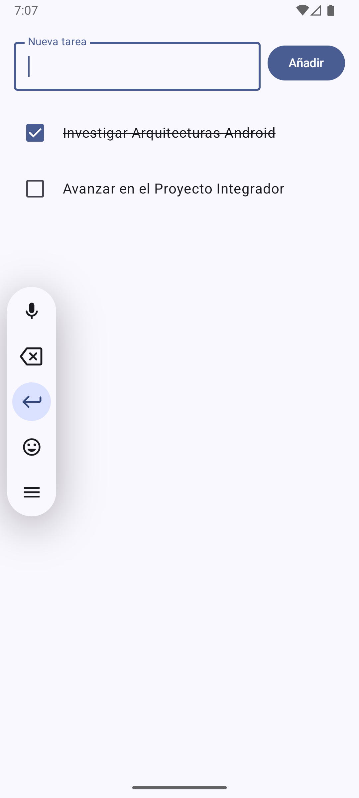

# Prueba Arquitectura Limpia

Este proyecto es una demostración de **Arquitectura Limpia (Clean Architecture)** en Android, desarrollada con Kotlin y Jetpack Compose. El objetivo principal es mostrar la separación de preocupaciones y la mantenibilidad del código.

## Características

- **Gestión de Tareas:** Visualización, adición y cambio de estado (completado/pendiente) de tareas.
- **Clean Architecture:** Separación clara en capas de Dominio, Datos y Presentación.
- **Jetpack Compose:** Interfaz de usuario moderna y declarativa.
- **ViewModel & State:** Gestión eficiente del estado de la UI.

## Estructura del Proyecto

El código está organizado siguiendo los principios de Clean Architecture:

- **`domain`**: Contiene la lógica de negocio pura.
  - `model`: Definición de entidades (`Tarea`).
  - `repository`: Interfaces que definen el contrato de datos.
  - `usecase`: Casos de uso específicos (`ObtenerTareasUseCase`, `AgregarTareaUseCase`, etc.).
- **`data`**: Implementaciones de los repositorios y fuentes de datos.
  - `TareaRepositoryInMemoryImpl`: Implementación en memoria para persistencia volátil.
- **`presentation`**: Capa de UI.
  - `ui`: Pantallas y componentes de Compose (`TareasScreen`).
  - `viewmodel`: Controladores de estado para la UI.

## Captura de Pantalla

